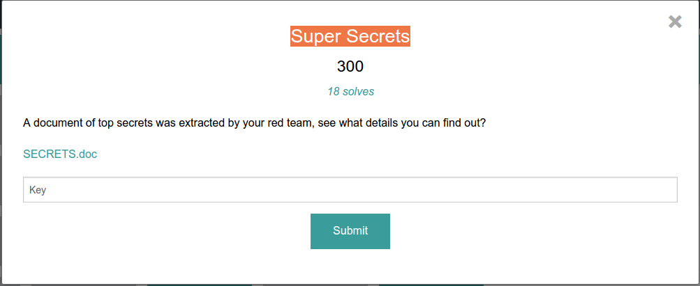

Super Secrets: Misc 300
----------------------



This was a super easy misc question. This should of been worth 150 or so points instead.

We given a link to a document : [SECRETS.doc](SECRETS.doc). Opening it up in LibreWriter or Microsoft office showed us some text.

```
TOP SECRET
This document is full of top secret secrets that are property of RedTeamHackers. If you are not one of us (probably aren't so listen up), don't view the rest of this document. That would not be cool, and we will totally retaliate against you. 

Member List
All great overlord organizations need accountability, so here we go. The following list is a list of all of our top members. 

Lastname
Firstname
SSN
Lion
Snoop
393-05-4706
T
Water
331-32-4704
Nips
Flippy
222-333-1131
Sanchez
Rick
234-31-3444
Duck
Donnald
311-23-6645
Jenkins
Smitty
643-23-6563


¡ʞɔnl pooƃ ˙ʍouʞ ʇ,uop ı ¿ʞɹoʍ uǝʌǝ ʇɐɥʇ sǝop ʍoɥ ¿ʇɐɥʇ sǝop llǝɥ ǝɥʇ oɥʍ ʇnq ˙ʎʞɐǝus ʎʇʇǝɹd ǝq plnoʍ ʇɐɥʇ ˙ƃuıop ǝɹ,noʎ ʇɐɥʍ ʞɔɐɹʇ sʎɐʍlɐ uɐɔ ɯɐǝʇ pǝɹ os ʞɔɐqllɐɔ ʇǝɹɔǝs ɹǝdns ɐ s,ʇı ǝqʎɐɯ ˙ʇou ʎlqɐqoɹd ɥɐu 'uoıssıɯ uoıʇɐɹʇlıɟ-xǝ ʇǝɹɔǝs ɐ s,ʇı ǝqʎɐɯ ˙uoıʇsǝnb ƃuıʇsǝɹǝʇuı ʎʇʇǝɹd ɐ s,ʇɐɥʇ ¿uoısɹǝʌıp ɐ ʇsnɾ llɐ sɐʍ sıɥʇ ɟı sɐʍ ǝʌıʇɔǝɾqo lɐǝɹ ǝɥʇ ʇɐɥʍ ɹǝpuoʍ ı ˙ʍouʞ ı 'ɹǝʌǝlɔ ˙uoısɹǝʌıp ʇuɐıƃ ɐ llɐ sɐʍ sıɥʇ ˙ʇıq ǝuo ʇou ˙ǝdou ˙ɹǝʇʇɐɯ uǝʌǝ ʇ,usǝop ʇı ʇɐɥʇ sı 'sıɥʇ ɟo llɐ ʇnoqɐ ʇɹɐd ʇsǝq ǝɥʇ 'ǝǝs noʎ ˙˙˙pɐq ʎɯ ˙˙˙ʇɥƃıɹ ɯǝǝs ʇ,usǝop ƃɐlɟ ʇɐɥʇ 'ʇıɐʍ ɥo ¿noʎ ʇ,uǝɹɐ ɹǝʌǝlɔ uɹɐp ɥsoƃ ʎʇǝɹd ǝɹ,noʎ ˙noʎ ɹoɟ pooƃ ¡ʇı pıp noʎ ¡sʇɐɹƃuoɔ ˙ގގގގ-ǝʞoɾ-ᄐɔɹ :sı ʇı ǝɹǝɥ ¿ʎpɐǝɹ noʎ ˙ƃɐlɟ ǝɥʇ noʎ ǝʌıƃ ʇsnɾ oʇ ƃuıoƃ ɯ,ı pǝssǝɹdɯı os ɯ,ı ˙noʎ ɹoɟ pooƃ 'ʎlʇsǝuoɥ ǝʌıssǝɹdɯı ǝq p,ʇɐɥʇ ¿ɹoʇɐʇoɹ ʇxǝʇ uʍo ɹnoʎ ʇuǝɯǝldɯı 'ɹoʇɐʇoɹ ʇxǝʇ ɐ ɹoɟ ǝlƃooƃ 'uǝǝɹɔs ɹnoʎ ǝʇɐʇoɹ 'ǝpısdn ɟlǝsɹnoʎ uɹnʇ ʎldɯıs noʎ pıp ¿ʇı op noʎ pıp ʍoɥ ˙ǝʌıssǝɹdɯı sı ʇɐɥʇ 'ʇxǝʇ sıɥʇ dılɟun oʇ ǝɯıʇ ǝɥʇ ʇuǝds noʎ ǝǝs ı ˙ǝɹǝɥʇ ıɥ 
```

As you can see there is no simple clue for the flag. There is some upside-down text, but I completey skipped this. For questions like this, we usually require some raw data analysis. Taking from what I know from PDF Analysis, I opened it up in a simple text editor to see what we get.

```
<html>
<head>
</head>

<body>
<h1>TOP SECRET</h1>
<p>This document is full of top secret secrets that are property of RedTeamHackers. If you are not one of us (probably aren't so listen up), don't view the rest of this document. That would not be cool, and we will totally retaliate against you.
</p>
<br><br>
<h2>Member List</h2>
<p>All great overlord organizations need accountability, so here we go. The following list is a list of all of our top members.
</p>
<br>
<table>
    <tr>
        <td><strong>Lastname</strong></td>
        <td><strong>Firstname</strong></td>
        <td><strong>SSN</strong></td>
    </tr>
    <tr>
        <td>Lion</td>
        <td>Snoop</td>
        <td>393-05-4706</td>
    </tr>
    <tr>
        <td>T</td>
        <td>Water</td>
        <td>331-32-4704</td>
    </tr>
    <tr>
        <td>Nips</td>
        <td>Flippy</td>
        <td>222-333-1131</td>
    </tr>
    <tr>
        <td>Sanchez</td>
        <td>Rick</td>
        <td>234-31-3444</td>
    </tr>
    <tr>
        <td>Duck</td>
        <td>Donnald</td>
        <td>311-23-6645</td>
    </tr>
    <tr>
        <td>Jenkins</td>
        <td>Smitty</td>
        <td>643-23-6563</td>
    </tr>
</table>
    <br><br>
¡ʞɔnl pooƃ ˙ʍouʞ ʇ,uop ı ¿ʞɹoʍ uǝʌǝ ʇɐɥʇ sǝop ʍoɥ ¿ʇɐɥʇ sǝop llǝɥ ǝɥʇ oɥʍ ʇnq ˙ʎʞɐǝus ʎʇʇǝɹd ǝq plnoʍ ʇɐɥʇ ˙ƃuıop ǝɹ,noʎ ʇɐɥʍ ʞɔɐɹʇ sʎɐʍlɐ uɐɔ ɯɐǝʇ pǝɹ os ʞɔɐqllɐɔ ʇǝɹɔǝs ɹǝdns ɐ s,ʇı ǝqʎɐɯ  ˙ʇou ʎlqɐqoɹd ɥɐu 'uoıssıɯ uoıʇɐɹʇlıɟ-xǝ ʇǝɹɔǝs ɐ s,ʇı ǝqʎɐɯ ˙uoıʇsǝnb ƃuıʇsǝɹǝʇuı ʎʇʇǝɹd ɐ s,ʇɐɥʇ ¿uoısɹǝʌıp ɐ ʇsnɾ llɐ sɐʍ sıɥʇ ɟı sɐʍ ǝʌıʇɔǝɾqo lɐǝɹ ǝɥʇ ʇɐɥʍ ɹǝpuoʍ ı ˙ʍouʞ ı 'ɹǝʌǝlɔ ˙uoısɹǝʌıp ʇuɐıƃ ɐ llɐ sɐʍ sıɥʇ ˙ʇıq ǝuo ʇou ˙ǝdou ˙ɹǝʇʇɐɯ uǝʌǝ ʇ,usǝop ʇı ʇɐɥʇ sı 'sıɥʇ ɟo llɐ ʇnoqɐ ʇɹɐd ʇsǝq ǝɥʇ 'ǝǝs noʎ  ˙˙˙pɐq ʎɯ ˙˙˙ʇɥƃıɹ ɯǝǝs ʇ,usǝop ƃɐlɟ ʇɐɥʇ 'ʇıɐʍ ɥo ¿noʎ ʇ,uǝɹɐ ɹǝʌǝlɔ uɹɐp ɥsoƃ ʎʇǝɹd ǝɹ,noʎ ˙noʎ ɹoɟ pooƃ ¡ʇı pıp noʎ ¡sʇɐɹƃuoɔ ˙ގގގގ-ǝʞoɾ-ᄐɔɹ :sı ʇı ǝɹǝɥ ¿ʎpɐǝɹ noʎ ˙ƃɐlɟ ǝɥʇ noʎ ǝʌıƃ ʇsnɾ oʇ ƃuıoƃ ɯ,ı pǝssǝɹdɯı os ɯ,ı ˙noʎ ɹoɟ pooƃ 'ʎlʇsǝuoɥ ǝʌıssǝɹdɯı ǝq p,ʇɐɥʇ ¿ɹoʇɐʇoɹ ʇxǝʇ uʍo ɹnoʎ ʇuǝɯǝldɯı 'ɹoʇɐʇoɹ ʇxǝʇ ɐ ɹoɟ ǝlƃooƃ 'uǝǝɹɔs ɹnoʎ ǝʇɐʇoɹ 'ǝpısdn ɟlǝsɹnoʎ uɹnʇ ʎldɯıs noʎ pıp ¿ʇı op noʎ pıp ʍoɥ ˙ǝʌıssǝɹdɯı sı ʇɐɥʇ 'ʇxǝʇ sıɥʇ dılɟun oʇ ǝɯıʇ ǝɥʇ ʇuǝds noʎ ǝǝs ı ˙ǝɹǝɥʇ ıɥ

    
</body>
</html>

```

You can clearly see this is HTML. This was surprising for me because I didn't know LibreWriter knew how to format HTML. If you look at the bottom you can clearly see a img tag with the dimensions 1x1 with the flag. 

The flag is **RC3-RedTeamGetRekt-1010101**