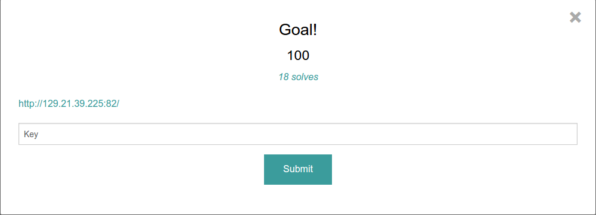
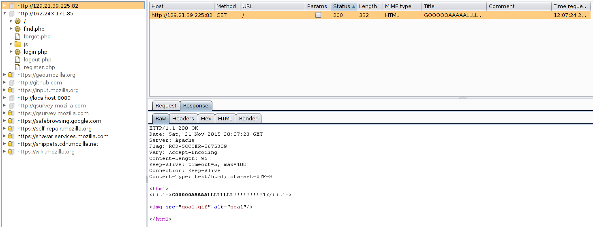

Goal!: 100
----------------------



Another baby CTF question. It was very simple, even though it did throw me off quite a bit... We are given a link: [http://129.21.39.225:82/](http://129.21.39.225:82/). When visiting the site all it had was a gif of some guys playing soccer 


Maybe we should look at the [source](source.html)?

```html
<html>
<title>GOOOOOAAAAALLLLLLLL!!!!!!!!!1</title>


</html>

```

No helpful data in there. I tried going a quick directory search such as /flag, /.git, and /admin and none of those worked. I also tried looking at the metadeta

>exiftool goal.gif

```
ExifTool Version Number         : 9.46
File Name                       : goal.gif
Directory                       : .
File Size                       : 3.0 MB
File Modification Date/Time     : 2015:11:21 12:06:36-08:00
File Access Date/Time           : 2015:11:21 12:06:36-08:00
File Inode Change Date/Time     : 2015:11:21 12:06:36-08:00
File Permissions                : rw-r-----
File Type                       : GIF
MIME Type                       : image/gif
GIF Version                     : 89a
Image Width                     : 407
Image Height                    : 211
Has Color Map                   : Yes
Color Resolution Depth          : 7
Bits Per Pixel                  : 7
Background Color                : 121
Animation Iterations            : Infinite
Frame Count                     : 78
Duration                        : 4.68 s
Image Size                      : 407x211
```

Nothing showed up there either. Luckily I always keep **Burp Suite** and **Zap Proxy** up. Let's look at the [request](request). I opened my Burp, searched for the ip address, searched for the page, and looked at the [request](request).


Everything looks normal there. Now let's look at the [response](response) from the web server.



We see something very interesting here. There's a section called "Flag" with the value: RC3-SOCCER-8675309.  Finally we have the flag: **RC3-SOCCER-8675309**
