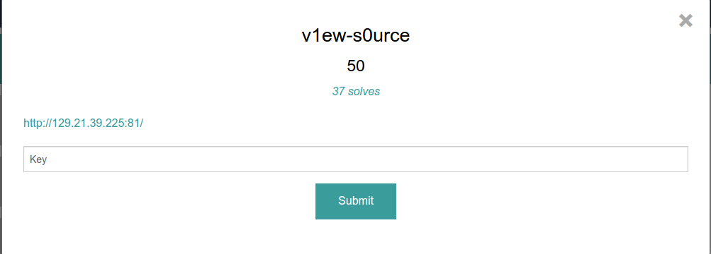
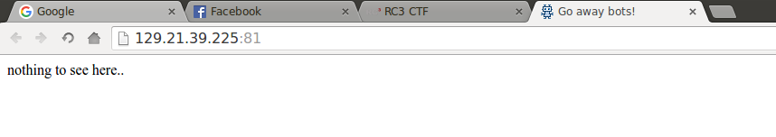

v1ew-s0urce: Web 50
----------------------



This a baby CTF question. It was very simple. We are given a link: [http://129.21.39.225:81/](http://129.21.39.225:81/). Upon visiting the site we are greeted with a simple text

> nothing to see here..

Now look at the title of the web page.



It says Go away bots! This means they don't want a web crawler to be at this website. If you guys know basic web, the way you keep web crawlers from visiting certain web pages is to write it in the robots.txt file.

Let's visit [http://129.21.39.225:81/robots.txt](http://129.21.39.225:81/robots.txt)

[robots.txt](robots.txt)
```
#Now those silly bots can't crawl my site :3

User-agent: *
Disallow: /admin/
Disallow: /secret/
```

This means they don't want the web page to visit /admin or /secret.

Let's visit [http://129.21.39.225:81/secret](http://129.21.39.225:81/secret) too


Now we have the flag:

RC3-ROBOTZ-559672